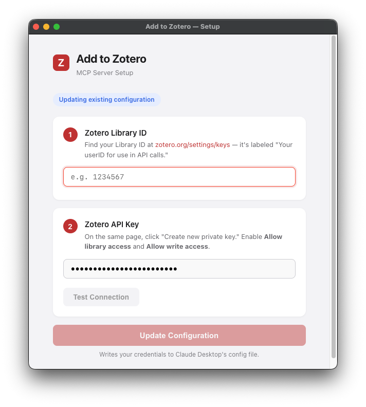
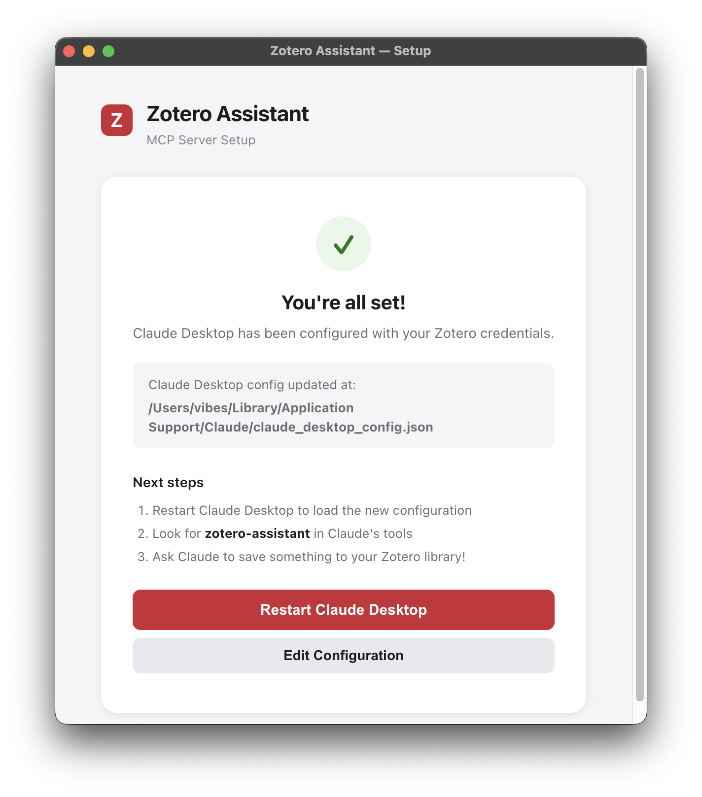

# Zotero Assistant — MCP Server

A Node.js MCP server that lets Claude Desktop **read, write, and manage** items in your Zotero library.

> **Alpha release** — This project is under active development. Please [report issues](../../issues) if you run into problems.

## Features

- **Search & browse** your Zotero library (full-text search, tags, collections)
- **Read** item metadata and extracted full-text content
- **Create** any Zotero item type (articles, books, webpages, reports, legal docs, etc.)
- **Attach** PDFs from URLs or save webpage snapshots
- **Organize** into collections with descriptive tags
- **Annotate** items with notes and analysis
- **Update** metadata, tags, and collections on existing items

## Installation

### Downloaded Setup App (Recommended)

1. Download the latest release
2. Enter your Zotero API credentials
3. Click **Test Connection** to verify
4. Click **Save & Configure Claude Desktop**
5. Click **Restart Claude Desktop** to load the new configuration

#### Setup App Download Links

[](../../releases/latest/download/Zotero-Assistant-Setup.dmg)
[](../../releases/latest/download/Zotero-Assistant-Setup.exe)

#### Configure Setup App

<p align="center">
  
  
</p>

Run the setup app, enter your Zotero API credentials, and it will configure Claude Desktop automatically.

### Manual Setup

#### 1. Get Zotero API Credentials

1. Go to https://www.zotero.org/settings/keys
2. Note your **Library ID** (shown at the top: "Your userID for use in API calls is: XXXXXX")
3. Create a new API key with **read/write access** to your library

#### 2. Install Dependencies

```bash
cd server
npm install
```

#### 3. Configure Claude Desktop

Add to your Claude Desktop config file:

**macOS:** `~/Library/Application Support/Claude/claude_desktop_config.json`
**Windows:** `%APPDATA%\Claude\claude_desktop_config.json`
**Linux:** `~/.config/Claude/claude_desktop_config.json`

```json
{
  "mcpServers": {
    "zotero-assistant": {
      "command": "node",
      "args": ["/path/to/zotero-assistant-mcp/server/index.js"],
      "env": {
        "ZOTERO_API_KEY": "your_api_key_here",
        "ZOTERO_LIBRARY_ID": "your_library_id_here"
      }
    }
  }
}
```

#### 4. Restart Claude Desktop

The "zotero-assistant" tools should now appear.

## Usage

Once connected, you can ask Claude to:

- "Search my Zotero for papers about machine learning"
- "Add this article to my Zotero library" (give it a URL)
- "What's in my 'Research' collection?"
- "Show me the full text of this item"
- "Save a snapshot of this webpage to Zotero"
- "Add a summary note to this item"
- "Tag this item with 'important' and 'to-read'"

## Available Tools

### Search & Browse
| Tool | Description |
|------|-------------|
| `search_items` | Search library by text, tags, type, or collection |
| `get_collection_items` | List items in a specific collection |
| `get_recent_items` | Recently added/modified items |
| `list_collections` | All collections (folders) in the library |
| `list_tags` | All tags in library |

### Read
| Tool | Description |
|------|-------------|
| `get_item` | Full metadata + children summary for a single item |
| `get_item_fulltext` | Extracted text content (from PDFs, notes, etc.) |

### Write
| Tool | Description |
|------|-------------|
| `save_item` | Create new item with metadata + attachments |
| `attach_pdf` | Attach PDF to existing item |
| `attach_snapshot` | Attach webpage snapshot to existing item |
| `create_note` | Create note on existing item |
| `update_item` | Modify metadata/tags on existing item |

### Utility
| Tool | Description |
|------|-------------|
| `get_help` | Workflow instructions |
| `get_item_types` | List valid item types |
| `prepare_url` | Get fetch instructions for a URL |

## Item Types

`article` / `journal`, `book`, `chapter`, `conference`, `thesis`, `report`, `webpage`, `blog`, `news`, `magazine`, `document`, `legal`, `case`, `patent`, `video`, `podcast`, `presentation`

## Troubleshooting
**Claude can't find the Zotero Assistant tools** — Make you are using the latest version of Claude Desktop. Restart Claude Desktop and try again.

**"Zotero not configured"** — Check that `ZOTERO_API_KEY` and `ZOTERO_LIBRARY_ID` are set in your Claude Desktop config.

**"Invalid item type"** — Use one of the supported types listed above.

**PDF attachment fails** — Some sites block automated downloads; try a direct PDF URL.

**Node.js not found** — The MCP server runs on Node.js. Install it from https://nodejs.org if you don't have it.

## License

MIT
